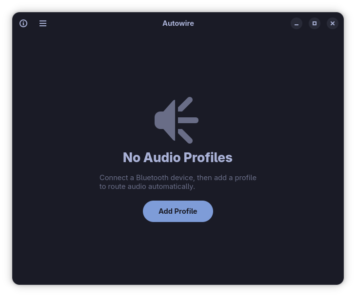
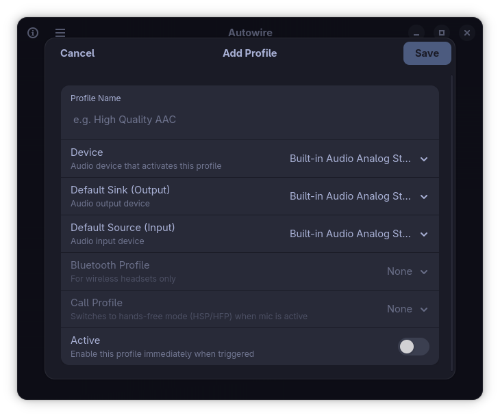

# Autowire

**Automated Audio Profile Manager for GNOME**

Autowire automatically switches your PipeWire/WirePlumber audio routing whenever your hardware environment changes. Define a profile once — link a USB dock, Bluetooth headset, or HDMI monitor to a set of default inputs and outputs — and Autowire silently applies it every time that device connects.

---

## Features

- Create named Audio Profiles triggered by any audio device
- Automatically switch default output (speakers, headphones) and input (microphone)
- Event-driven background daemon — near-zero resource usage at idle
- Clean Libadwaita UI that matches GNOME Settings
- Runs as a `systemd --user` service — works even when the UI is closed
- Force high-quality Bluetooth codecs (AAC, LDAC, aptX) instead of mSBC
- Multiple profiles per device — switch between "Music" and "Call" modes
- **Auto-switch for calls** — daemon detects active mic streams and drops to HSP/HFP automatically, restoring A2DP when capture ends (3s debounce)
- Only the **active** profile fires when a device connects, eliminating race conditions
- **Import/Export** — gear menu with `Gtk.FileDialog` for sharing all profiles as JSON
- **Desktop notifications** — daemon notifies on routing events (profile match, call switch)
- **Keyboard shortcuts** — `Ctrl+N` (add profile), `Ctrl+Q` (quit), `F5` (refresh)
- **File-based logging** — daemon logs to `~/.config/autowire/daemon.log` with auto-rotation
- **Daemon crash detection** — UI immediately re-spawns daemon on unexpected exit

---

## Screenshots

<table>
  <tr>
    <td></td>
    <td></td>
  </tr>
  <tr>
    <td align="center">Main window — profile list grouped by device</td>
    <td align="center">Profile dialog — create or edit a profile</td>
  </tr>
</table>

---

## Requirements

| Dependency     | Version | Notes |
|----------------|---------|-------|
| GNOME Platform | 50      |       |
| GTK            | 4.0     |       |
| Libadwaita     | 1.5+    |       |
| WirePlumber    | 0.5+    | Optional — missing on Flatpak //50, uses poll-only |
| GJS            | 1.80+   |       |
| PipeWire       | ≥ 1.0   | Tested on 1.6.6 |


---

## Quick Local Run (GJS)

```bash
# Install system dependencies (Fedora)
sudo dnf install gjs gtk4 libadwaita wireplumber

# Run the UI
gjs -I src/ src/main.js

# Run the daemon
gjs -I src/ src/daemon_main.js
```

No build step required — builds its UI programmatically.

---

## Flatpak

```bash
flatpak-builder --force-clean --user --install _flatpak_build \
    io.github.nidszxh.Autowire.json
flatpak run io.github.nidszxh.Autowire

# Flatpak daemon (uses the same app with a different entry point)
flatpak run --command=autowire-daemon io.github.nidszxh.Autowire
```

---

## How It Works

### Two Processes, One JSON

```
 UI (GTK) ──write──▶  profiles.json  ◀──watch──  Daemon (GLib)
```

1. **UI** writes profiles.json when you create, edit, or delete a profile
2. **Daemon** watches profiles.json and re-routes audio on changes
3. **Daemon** also polls PipeWire every 3 seconds for new or removed audio devices
4. No IPC — just a shared JSON file on disk

### Profile Matching Flow

1. A device connects (USB dock, Bluetooth headset, HDMI monitor)
2. The daemon detects the new device and loads profiles.json
3. It finds the active profile whose trigger matches the device name
4. If found, it applies the profile's actions:
   - Sets the default audio output (speakers, headset, etc.)
   - Sets the default audio input (microphone)
   - Forces the Bluetooth codec (AAC, LDAC, aptX, etc.)

### Auto-Switch for Calls (Bluetooth headsets)

When a profile has **Auto-switch for calls** enabled and an app starts using the microphone:

```
Capture starts → switch to HSP/HFP (headset profile)
              → route BT mic as default input

Capture stops → 3-second debounce (tolerates push-to-talk)
              → restore A2DP (high-quality audio)
              → route BT speakers as default output
```

1. An app captures the mic (Discord, Zoom, voice chat)
2. The daemon switches the headset to HSP/HFP mode — mic works
3. The app stops capturing — the daemon waits 3 seconds
4. If no new capture within 3 seconds, it restores A2DP mode — high-quality audio returns

### Active Profile Rule

Only **one** profile per trigger device can be `is_active: true`. When you save a profile with "Activate on Connect" enabled, all other profiles for that trigger are automatically deactivated. The daemon only fires the active one — no race conditions.

---

## Project Structure

```
autowire/
├── build-aux/meson/
│   └── postinstall.py         # Post-install: icon cache, db, systemd enable
│
├── src/                        # All GJS code (no Python)
│   ├── main.js                 # ──┐  UI entry (Adw.Application)
│   ├── window.js               #   │  Profile list, grouped by trigger
│   ├── profile_dialog.js       #   ├─ GTK4 + Adwaita
│   │                           #   │
│   ├── config_mgr.js           # ──┤  Shared: atomic JSON CRUD
│   ├── constants.js            #   │  Timing/interval constants
│   ├── log.js                  #   │  Structured logging
│   ├── utils.js                #   │  Flatpak detection, absolute path helpers
│   │                           #   │
│   ├── daemon.js               #   │  Routing engine + BT switching
│   ├── daemon_main.js          #   ├─ GLib-only (no GTK)
│   ├── wp_monitor.js           #   │  Poll-based WpCore wrapper
│   ├── bt_profiles.js          #   │  Codec-quality ladder
│   ├── pactl_parser.js         #   │  pactl card parser with 1s cache
│   │                           #   │
│   ├── autowire.in             # ──┤  Meson launchers (bash+gjs)
│   ├── autowire-daemon.in      #   │
│   └── meson.build
│
├── tests/
│   ├── test.sh                 # Shell runner
│   ├── test_bt_profiles.js     # Codec ladder pickBest logic (25)
│   ├── test_config_mgr.js      # Config CRUD + migration (25)
│   ├── test_daemon.js          # Daemon routing + capture logic (52)
│   ├── test_log.js             # Log levels + file output (4)
│   ├── test_pactl_parser.js    # pactl card parsing (37)
│   ├── test_utils.js           # Subprocess + string helpers (19)
│   └── test_wp_monitor.js      # Stream parsing + detection (16)
│
├── docs/
│   └── architecture.md
│
├── data/
│   ├── screenshots/            # 4 screenshots (main, profile, add, edit)
│   ├── icons/hicolor/          # App icons (scalable + symbolic)
│   ├── *.service               # systemd --user + D-Bus session service
│   ├── io.github.nidszxh.Autowire.desktop.in
│   ├── io.github.nidszxh.Autowire.metainfo.xml
│   └── meson.build
│
├── io.github.nidszxh.Autowire.json   # Flatpak manifest
├── flathub.json                      # Flathub repo config (publish-delay-hours: 3)
├── meson.build                       # Root build definition
├── meson_options.txt                 # Meson options (profile=devel/release)
├── CHANGELOG.md                      # Release notes
├── CONTRIBUTING.md                   # Contributor guide
├── AGENTS.md                         # LLM agent instructions
└── LICENSE                           # GPL-3.0
```


## License

GNU General Public License v3.0 or later — see [LICENSE](LICENSE) for details.
